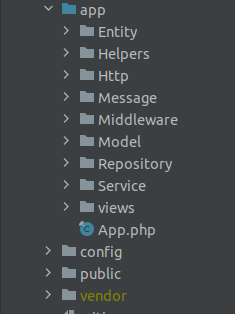
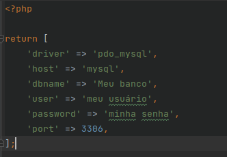

# Sobre o sistema
O sistema consiste em uma plataforma de gerenciamento de tarefas.

Para utilizar a plataforma primeiro deve-se realizar um cadastro nela.

Cada um dos usuários pode criar tarefas no sistema, após criadas, as tarefas podem ser movidas de colunas
utilizando o mouse.

Em cada uma das tarefas pode-se clicar para ver os detalhes, fazer comentários e verificar o histórico.

### O que foi utilizado?
Para o desenvolvimento do sistema foi utilizado o Slim framework como base, para o gerenciamento do banco de dados
foi utilizado o Doctrine e nas Views optei pela utilização do Twig.

Abaixo temos como ficou dividido a estrutura do projeto.



Dentro da pasta Http temos a divisão entre **api** e **site** a parte da **api** e responsável por receger requisições via post
e redirecionar para os model respectivos que contem a regra do fluxo.

Já a pasta **site** fica por conta de receber requisições que tem como objetivo renderizar alguma view para o usuario.

Cada fluxo foi separado por pastas para ficar masi organizado.

Dentro de app temos um arquivo chamado **App.php** essa classe e responsável por iniciar o sistema, realizando assim
todas as configurações iniciais exigidas.

Foi criado uma classe de mensagens dentro da pasta **Message** que fica responsável por concentrar as mensagens que serão
retornadas ao usuário.

Para a utilização do doctrine da melhor forma foi criado dentro de **Repository** a classe pai dos repositórios **Repository.php**
para que todos os repositórios possam extender dela para pegar os dados de conexão com o banco e utilizar o entityManager.

Os repositórios foram divididos cada um por pastas referentes aos fluxos.

Na pasta **Entity** ficou o relacionamento de entidades do doctrine fazendo referencia com o banco de dados.

Foi utilizado Middleware para iniciar a sessão e verificar se o usuário esta logado no sistema.

Na tela de tarefas na alteração de status das mesmas foi utilizado o recurso drag and drop (arrastar e soltar) com isso
o usuário tem uma maior interação com o sistema alterando assim o status da tarefa após solta-la na nova coluna.

Para que todos os usuarios possam sempre ver o quadro atualizado foi utilizado o eventsource que fica verificando sempre o ultimo
Id na tabela de historico para que se houver alguma alteração atualizar o quadro.

Com isso todos os usuário sempre visualizam o quadro atualizado.

# Instalação & montagem do ambiente.

- É preciso clonar o progeto utilizando o comando abaixo.

  - git clone https://github.com/p21joaovitor/desafio_tecnico.git

### Montando o ambiente

Com o ambiente clonado dentro de www/config é preciso criar um arquivo chamado **database.php** para conter as
informações de conexão com o banco de dados.

Segue abaixo a estrutura do arquivo.



**Altere os dados do arquivo database.php para os dados da sua conexão**

Com o repositório clonado e preciso alterar o nome do arquivo env-exemple para **.env** e com isso alterar os dados dentro.

- **CONTANER_NAME**: Se desejar e so trocar o nome que esta no arquivo para o nome desejado.
- **PROJECT**: Manter como vem no arquivo.
- **PORT_NGINX**: Caso queira coloque a porta de acesso de sua preferencia.
- **PORT_NGINX_SSL**: Caso queira coloque a porta de acesso de sua preferencia.
- **PORT_MYSQL**: Caso queira coloque a porta de acesso de sua preferencia.
- **MYSQL_ROOT_PASSWORD=**: Senha root de acesso ao banco.
- **MYSQL_DATABASE**: Nome do banco de dados

**Caso tenha alterado o CONTAINER_NAME é preciso alterar tbm no arquivo default.conf na linha 51 no caminho config/nginx**

Feito o ajuste do .env podemos executar o build do sistema.

```docker composer build --no-cache```

com o comando acima executado podemos subir o sistema executando o comando abaixo.

```docker compose up -d --force-recreate```

Feito isso dentro da pasta **docs/sql** temos os scripts do banco de dados da aplicação.

**Execute o script em seu SGBD para que tenha todas as tabelas do sistema.**

Com as imagens do sistema criado no terminal do contêiner docker do PHP é preciso executar o comando abaixo para instalar
as dependências do sistema.

```php composer.phar install```
